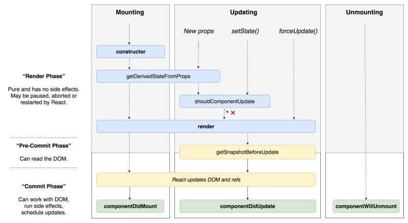

##### `Hooks`
- [x] State
- [x] Lifecycle Methods
- [x] Sharing Non-Visual Logic


```js
// Rules

function Counter () {
  // 👍 from the top level function component
  const [count, setCount] = React.useState(0)

  if (count % 2 === 0) {
    // 👎 not from the top level
    React.useEffect(() => {})
  }

  const handleIncrement = () => {
    setCount((c) => c + 1)

    // 👎 not from the top level
    React.useEffect(() => {})
  }
}

function useAuthed () {
  // 👍 from the top level of a custom Hook
  const [authed, setAuthed] = React.useState(false)
}
class Counter extends React.Component {
  render () {
    // 👎 from inside a Class component
    const [count, setCount] = React.useState(0)
  }
}
function getUser () {
  // 👎 from inside a normal function
  const [user, setUser] = React.useState(null)
}


// useEffect
React.useEffect(() => {
  // Will be invoked on the initial render 
  // and all subsequent re-renders.
})

React.useEffect(() => {
  // Will be invoked on the initial render
  // and when "id" or "authed" changes
}, [id, authed])

React.useEffect(() => {
  // Will only be invoked on the initial render
}, [])


// Custom Hook -- to share logic between Components
function useRepos(id) {
  const [repos, setRepos] = React.useState([]); // Local State
  const [loading, setLoading] = React.useState(true); // Local State

  React.useEffect(() => { // componentDidMount & componentDidUpdate
    
    setLoading(true);

    fetchRepos(id).then(repos => {
      setRepos(repos);
      setLoading(false);
    });
  }, [id]);

  return [loading, repos];
}
```

**`Mounting Stage` -- called in the following order**
> constructor()  
> static getDerivedStateFromProps()  
> render()  
> componentDidMount()  


**`Updating Stage` -- called in the following order**
> static getDerivedStateFromProps()  
> shouldComponentUpdate()  
> render()  
> getSnapshotBeforeUpdate()  
> componentDidUpdate()  

**`Unmounting Stage` -- called in the following order**
> componentWillUnmount()  

**Removed Methods**
 - componentWillUpdate()
 - componentWillReceiveProps()
 - componentWillMount()


# React Life Cycle Hooks


**constructor**
- [x] initialize `state`
- [x] before `mounted`

**getDerivedStateFromProps**
- [x] called `before` `render` method
- [x] initial `mount` and on subsequent `updates`
- [x] return `object` to update the `state` or `null`

**shouldComponentUpdate**
 - [x] return `false` will prevent `re-rendering`

**componentDidMount**
- [x] after attached to the DOM
- [x] fetch API

**componentWillUnmount**
- [x] before dettached from the DOM
- [x] Perform any necessary cleanup

**componentDidUpdate**
- [x] after `update`
- [x] will not be invoked if shouldComponentUpdate() returns `false`

```js
this.setState((state, props) => {
  return {counter: state.counter + props.step};
});
```

**PureComponent** performs a shallow comparison of `props` and `state`, and reduces the chance that you’ll skip a necessary update

compare `this.props` with `nextProps` and `this.state` with `nextState` and return `false` to tell React the update can be skipped
